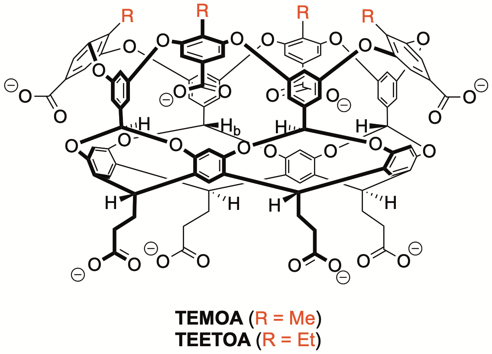

# The SAMPL8 GDCC Challenge

For SAMPL7, the Gibb group is contributing binding data for five
guests to two Gibb Deep Cavity Cavitand (GDCC) hosts related to the "octa acid"
hosts seen in prior challenges. One is the [TEMOA ("OAH") host seen in SAMPL6](https://github.com/samplchallenges/SAMPL6/blob/master/host_guest_description.md) and the other, named TEETOA, differs by the replacement of a methyl at the cavity rim with an ethyl.

## Challenge timing details

The SAMPL8 GDCC challenge design is now finalized (as of Oct. 14, 2020) with the details as given below.
The challenge submission deadline is Feb. 4, 2021.
The challenge consists of predicting binding free energies of five compounds to both of TEMOA and TEETOA.

Additional files/inputs will be provided in the near future.

## The SAMPL8 GDCC Challenge: Sterics and flexibility

The two hosts shown below, tetramethyl octa acid (TEMOA) and tetraethyl octa acid (TEETOA) differ only in the functionalization around the cavity rim.

The Gibb group will examine the binding of five guests: four negatively charged, and one likely neutral.
As in SAMPL7, all binding constants will be determined in (10 mM) sodium phosphate buffer, here at pH 11.5.
Each of these new binding determinations will be carried out in triplicate using ITC, and where necessary, verified by NMR (or measured by NMR, for very weak binders). Here are the guests:

For all compounds for which binding is being determined by ITC, binding enthalpy measurements will also be available. Thus, binding enthalpy values can optionally be submitted and will be judged as data is available (that is, for most compounds). In general, Ka and ΔH will be extracted from each ITC experiment, and used to derive ΔG and –TΔS. If the binding is too weak for ITC, experiments will fall back to NMR, and ΔG will be extracted from Ka.

### Additional technical details

Buffer conditions are 10 mM sodium phosphate at pH 11.5+/-0.1. The plan is to gather data in triplicate (or more) with fresh solutions of host and guest on each occasion. Experiments will attempt to ensure all solutions for each experiment are within ±0.05 of each other to eliminate any neutralisation contributions to ΔH. The waters of hydration of each stock of host is determined by qNMR using a water soluble internal standard (sodium ethanesulfonate) of known precise concentration. This will ensure that the concentrations of host solutions are as accurate as possible to avoid misfits arising from concentration errors. Any N values that are less than 0.9 will be noted, and if we have to fix N to 1 because of weak binding, we’ll give spectroscopic evidence of a 1:1 binding event.

For positively charged guests, chloride salts are being used.

### Disclaimers

General disclaimer: The protonation state of the host may in some cases be not completely certain, and participants are also encouraged to carefully select guest protonation states. Protonation states and conformations may or may not match those of the files provided here.

# What's here

- `source_files`: Source files provided by Bruce Gibb and Paolo Suating, giving structures of hosts and guests. All other files provided here will be derived from these as we will document here. The ChemDraw files were provided by Bruce Gibb; Paolo Suating generated generated the mol2, sdf, and pdb files by hand from Spartan 14. All of hosts are gas-phase energy minimised structures using a PM6 semi-empirical method. The guests are gas-phase energy minimised structures using ωB97X-D/6-311+G**.
- selected image files derived from the source files
- `guest_files`: Generated structure files in `sdf`,`mol2`, and `pdb`, for guests (G1 - G5) related to SAMPL8 hosts TEMOA and TEEtOA.
- `host_files`: Generated structure files in `sdf`, `mol2`, and `pdb`, for SAMPL8 hosts TEMOA and TEEtOA
- `input_maker.ipynb`: Jupyter notebook to generate guest and host inputs from source files.  
- `GDCC_submission.txt`: Example submission file for submitting to our system (please replace text and values with your own!). Filenames must begin with "GDCC". See [host_guest_instructions.md](https://github.com/samplchallenges/SAMPL8/blob/master//host_guest_instructions.md) for submission instructions.

## What's coming
- Submission file format (likely to match SAMPL7)
- Submission instructions
